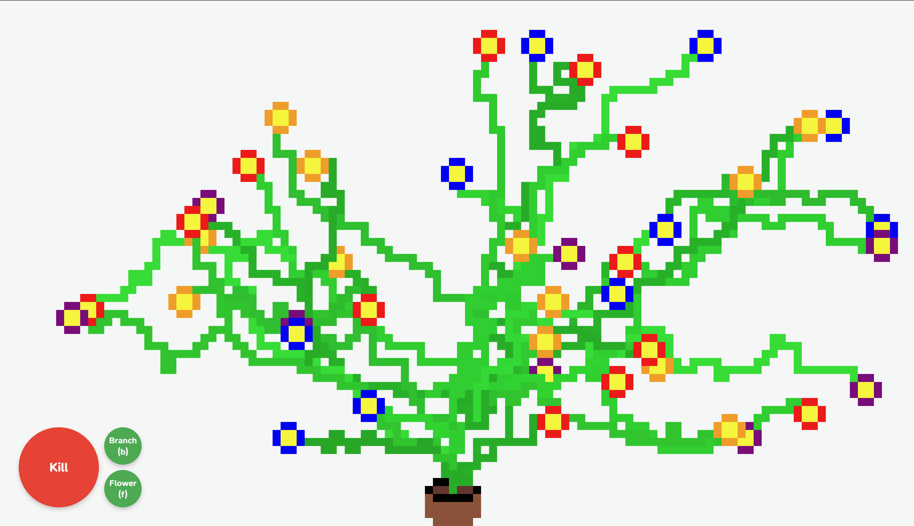

# Pixel Plants

This website interactively generates pixel art plants 🪴

Press <b>Grow</b> to start growing a plant out of the pot.  
Press <b>Branch</b> to start a new branch off of any existing branch.  
Press <b>Flower</b> to grow a flower at the end of any branch.  
Press <b>Kill</b> to reset your plant.

The video below demonstrates the different ways plants can be generated, such as only having one branch, spamming a ton of branches to make texture, spamming branches and flowers to make the pot covered in flowers, or not making any flowers at all:

https://github.com/user-attachments/assets/f61a659a-06dc-4fe3-94aa-bc6eed039447

## Botany

This section describes how plants are generated.

### Branches

The structure of how pixels of the branches of the plant are stored is similar to a tree data structure. Each pixel of a branch, including the initial branch (which you could also call a stem), is stored as a `BranchNode`. Each `BranchNode` stores its position, neighboring `BranchNodes`, color, and direction to grow. `BranchNode` has two important methods: 

#### `grow()` 

<b>Continues growth of every branch in the plant by one pixel. Automatically called every 100 ms.</b> 
 It is possible for a new node to grow either up, left, right, or down from the current node. The node's `angle` property guides its branch in a specific direction by changing the probabilities of each of these four directions. For example, if a node's `angle` is `90` (up), it will have a 50% chance of growing up and 25% chances of either right or left. After choosing a position, a new `BranchNode` will be created there with the same `color` and `angle` attributes as the current node. If this method is called on a node that is too close to the edge, a `Flower` will be created instead of growing. If this method is called on a node that is not at the end of the branch, it will instead call itself on each of the node's children (effectively using tree recursion to only grow the ends of every branch).

#### `branch()`

<b>Starts a new branch at a random point on the plant. Called by the user whenever.</b>
 With our current data structure, a "branch" is essentially just a series of nodes. By using the `grow()` method, we are essentially already creating new branches everywhere, but they just continue the same path. So, to start a branch with a new path, all we need to do is create a new `BranchNode` at a position that is not at the end of an existing branch. We can make the branch grow in a new general direction by changing this new node's `angle` property to + or - 45 degrees from the current node's `angle`. The method also assigns a random shade of green to the new node's `color` property. This method gets called on a randomly chosen node from the entire tree.

### Flowers

Flowers represented by the `Flower` class. They are created in two ways: 

1. When the <b>Flower</b> button is pressed by the user, a `Flower` is created at a random ending `BranchNode`.
2. When a `BranchNode` is too close to the edge, a `Flower` is created at that node.

When a `Flower` is created, it draws a 2x2 square of yellow pixels at the specified position to represent the center of the flower. It also chooses a random petal color and assigns it to its `color` property. Then, its `grow()` method is called automatically every 100 ms. This method draws a pixel of `color` at a random position around the center that doesn't already have a petal.

## Other Elements

### The Pot

I used <b>Aseprite</b> to draw the pot, then exported it to a png here. I added each pixel to the page using <b>p5js</b>.

### UI

The <b>Grow</b> button starts growing the plant. This button then transforms into the <b>Kill</b> button, which clears the plant. 

The <b>Branch</b> and <b>Flower</b> buttons only appear after <b>Grow</b> has been pressed. They can also be triggered with the keyboard by pressing the B or F key, respectively.

## Inspiration and Process

This project was made for an assignment called "Poetic, Uncertain" for the class DESINV 23 at UC Berkeley. The goal was basically to make something generative and expressive. I got the idea for this plant generator from a project we made in another class, CS61B. This project was a simple Java particle simulator, where pixels were generated in different ways to represent real things like water, sand, and fire. I wanted to try making something similar, but to generate something more expressive than basic materials/elements. I eventually settled on generating plants as opposed to buildings, animals, etc, because they would be the most straightforward to make, and even the simplest plant could be seen as beautiful. 

The first step was to figure out how to draw pixels to the screen in a grid formation. I used <b>p5js</b> for this, and it was pretty straightforward.

The next step was figuring out a way for branches to grow semi-randomly. I decided that the best way to represent a plant is by using a <b>tree data structure</b>, where each pixel is represented as a node object connected to other node objects. If you were to break a real plant into chunks, this is how it would physically be structured, with a starting node, nodes connected to other nodes to form paths, and ending nodes. Using this structure, growing a path just means creating an additional node next to the last node in an existing path. How the path looks is determined by which direction you place this new node relative to the previous node. How I did this is covered in [grow()](#grow).

Initially, I wanted to randomize the shapes of flowers as well. My idea was to represent the individual pixels of flowers by nodes as well, and grow them in random directions until a certain amount of pixels was reached. However, for simplicity, I decided to make every flower the same shape, with a 2x2 square in the middle followed by 8 petals immediately surrounding it. With this, there is at least some degree of randomness with where flowers are created, what color the petals are, and what order the petals grow in.

To make everything more aesthetically appealing, I made new branches different shades of green, added a simple pot to grow plants out of, and rounded the UI buttons. I think it looks very nice now.

## Ideas for the Future

* Random flower shape
* Different types of plants (including an evil plant)
* Ways to alter a plant to be more weird
* More details in the growing/killing of a plant (watering can, scissors, etc)
